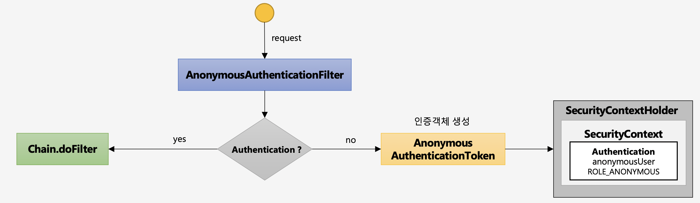

# 인증 API - 익명 사용자 인증

익명 사용자 인증이란 로그인을 한 사용자 이외의 익명의 사용자를 처리하기 위한 인증이다. 즉, 인증 사용자와 익명 사용자를 구분해서 처리하기 위한 용도로 사용하는 인증이다. 익명 사용자를 인증하기 위해서 스프링 시큐리티는 AnonymousAuthenticationFilter를 사용한다.

## AnonymousAuthenticationFilter

익명 사용자 인증필터를 거치려면 한 가지 조건이 필요한데, 그 조건은 다음과 같다.

- SecurityContext 에 인증 객체가 존재하지 않아야 한다.



이 조건을 만족하면 익명 사용자라는 조건에 만족하여 해당 필터가 동작하는데, 우선적으로 익명 사용자 전용 인증객체를 생성한다.

```java
AnonymousAuthenticationToken token = new AnonymousAuthenticationToken(this.key, this.principal,
				this.authorities);
```

이렇게 익명 사용자용 인증객체를 생성했으면, SecurityContext에 인증객체를 저장한다.  또한, 익명 사용자용 인증객체는 세션에는 저장하지 않는다.

```java
SecurityContext context = SecurityContextHolder.createEmptyContext();
			context.setAuthentication(authentication);
			SecurityContextHolder.setContext(context);
```

여기서 인증객체에 담겨있는 권한은 ROLE_ANONYMOUS로 저장된다.

```java
public AnonymousAuthenticationFilter(String key) {
		this(key, "anonymousUser", AuthorityUtils.createAuthorityList("ROLE_ANONYMOUS"));
	}
```

