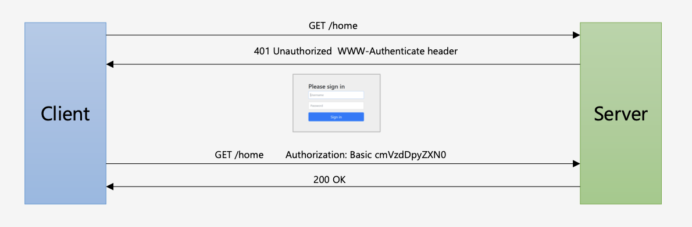
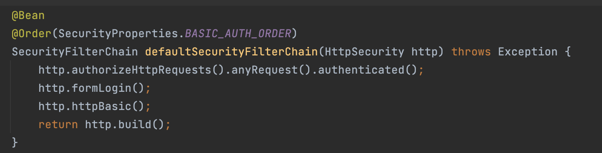
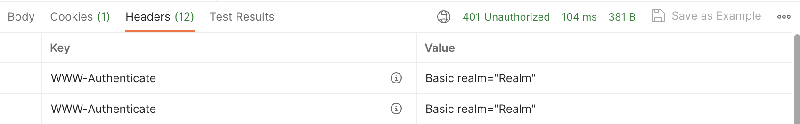
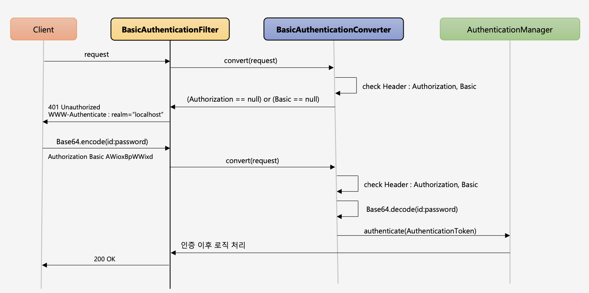

# 인증 API - HTTP Basic 인증, BasicAuthenticationFilter



사용자 정의 시큐리티 설정정보 클래스를 구현하지 않고 스프링 시큐리티가 기본적으로 구현한 설정정보를 이용하면 기본적으로 시큐리티는 Http Basic 인증을 사용한다.



HTTP Basic은 HTTP가 제공하는 자체적인 인증 관련 기능이고 HTTP 표준에 정의된 가장 단순한 인증 기법이다.

또한, 간단한 설정과 Stateless가 장점이고 Session Cookie를 사용하지 않는다.

인증 및 인가가 필요한 자원에 접근하면 클라이언트에게 401 Unauthorized 응답과 함께 WWW-Authenticate header를 기술해서 인증요구를 보낸다.



클라이언트는 ID, Password 값을 Base64로 인코딩한 문자열을 Authorization Header에 추가한 뒤 서버에게 자원을 요청하게 된다.

```text
Authorization: Basic cmVzdDpyZXN0...
```

ID, Password가 Base64로 인코딩되어 있어서 ID, Password가 외부에 쉽게 노출되는 구조이기 때문에 SSL, TLS는 필수이다.


## BasicAuthenticationFilter

HTTP Basic 기반 인가, 인증이 동작하는 과정은 다음과 같다.



1. 클라이언트로부터 ID, Password를 Base64로 인코딩한 사용자 정보를 받는다.
   - 사용자 정보가 헤더에 있고 디코딩이 가능하면 통과하고 인증 이후의 로직을 처리한다.
   - 헤더에 사용자 정보가 없고 헤더 값의 prefix에 Basic이 없으면 응답 코드로 401 Unauthorized를 반환하고 응답 헤더에 WWW-Authenticate 를 포함하여 응답한다.

