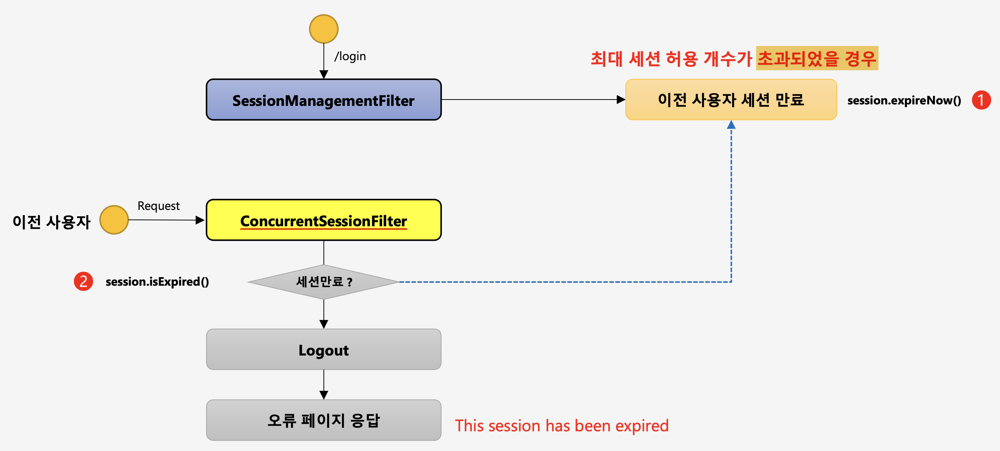

# 인증 API - 동시 세션 제어, 세션 고정보호, 세션 정책

## 동시 세션 제어

같은 아이디로 다른 세션에서 로그인을 시도하면 대부분의 웹 사이트는 이를 허용하지만, 인프런 같은 교육 사이트는 두 명이 동시에 강의를 듣는 것을 방지하기 위해서 두 개의 세션에서 로그인을 시도하면 세션을 만료시키는 것을 종종 볼 수 있다.

이는 동시 세션 제어에 속하는데, 스프링 시큐리티에서는 동시 세션 제어하는 방식을 두 가지로 제공한다.

- 이전 사용자 세션 만료
	- 이전에 로그인이 되어있던 세션을 만료시키는 전략이다.
- 현재 사용자 인증 실패
	- 이전에 로그인이 되어있는 세션이 있다면, 현재 사용자는 인증에 실패하는 전략이다.

 각 전략의 동작원리를 말하기 전에 우선적으로 세션 관리를 위한 설정을 하는 방법을 살펴보면 다음과 같다.
 
```java
http.sessionManagement()				//세션 관리기능 작동
.maximumSessions(1)				//최대 허용 세션 수, -1: 무제한 로그인 세션 허용
.maxSessionsPreventsLogin(true)		//동시 로그인을 차단한다, false: 기존 세션 만료(default)
.invalidSessionUrl("/invalid")			//세션이 유효하지 않을 때, 이동 할 페이지
.expiredUrl("/expired");				//세션이 만료된 경우 이동 할 페이지
```

## 세션 고정 보호

세션을 사용하면 HTTP 프로토콜의 단점을 보완하고 사용자의 정보를 페이지마다 유지할 수 있는 장점이 있지만, 세션 정보를 고정하여 사용하면 탈취당하여 해커가 사용할 가능성이 존재한다.

따라서 세션 ID 값을 바꿔가면서 사용하는 전략이 필요한데, 스프링 시큐리티는 이런 전략들을 제공한다.

```java
http.sessionManagement()
	.sessionFixation().changeSessionId()	//none, migrateSession, newSession, changeSessionId(기본값)이 존재한다.
```

- changeSessionId() : 인증 성공 시 세션 값은 그대로 두고 세션 ID만 변경해준다. (Servlet 3.1 이상 버전에서 기본값)
- migrateSession() : 인증 성공 시 세션 값은 그대로 두고 세션 ID 모두 변경해준다. (Servlet 3.1 이하 버전에서 기본값)
- newSession() : 인증 성공 시 이전 세션 값은 버리고 새로운 세션 ID, 값이 할당된다.
- none() : 세션이 새롭게 생성 X, 세션 ID도 바뀌지 않는다.

## 세션 정책

스프링 시큐리티는 세션을 언제 어느시점에 생성할까에 대한 정책도 여러가지 제공한다.

```java
http.sessionManagement()
	.sessionCreationPoicy(SessionCreationPolicy.If_Required)
```

- SessionCreationPolicy.Always : 스프링 시큐리티가 항상 세션을 생성한다.
- SessionCreationPolicy.If_Required : 스프링 시큐리티가 필요 시 생성한다.(기본값)
- SessionCreationPolicy.Never : 스프링 시큐리티가 생성하지 않지만 이미 존재하면 사용은 한다.
- SessionCreationPolicy.Stateless : 스프링 시큐리티가 생성하지 않고, 존재해도 사용하지 않는다.(JWT 인증 방식으로 인증 처리시 사용)
 
## SessionManagementFiler & ConcurrentSessionFilter

동시 세션 제어의 동작 원리를 그림으로 간단히 나타내면 다음과 같다.



이전에 사용자가 다른 세션에서 이미 로그인 한적이 있다고 가정한다.

1. 다른 세션에서 사용자의 로그인이 요청된다.

ConcurrentSessionControlAuthenticationStrategy 클래스가 이미 세션이 있는지 확인 후, 세션이 존재함을 알게된 상태이다.

```java
List<SessionInformation> sessions = this.sessionRegistry.getAllSessions(authentication.getPrincipal(), false);
int sessionCount = sessions.size();	//세션의 크기가 0이 아닐 것이다.
```

2. 인증실패 전략일 경우 예외를 UsernamePasswordAuthenticationFilter로 전달하여 예외를 처리하도록 하고, 아닐경우 expireNow()를 호출하여 전에 로그인했던 세션을 만료시킨다.

```java
if (this.exceptionIfMaximumExceeded || (sessions == null)) {
//인증 실패 전략시 예외를 던진다.
	throw new SessionAuthenticationException(
			this.messages.getMessage("ConcurrentSessionControlAuthenticationStrategy.exceededAllowed",
					new Object[] { allowableSessions }, "Maximum sessions of {0} for this principal exceeded"));
}
// Determine least recently used sessions, and mark them for invalidation
sessions.sort(Comparator.comparing(SessionInformation::getLastRequest));
int maximumSessionsExceededBy = sessions.size() - allowableSessions + 1;
List<SessionInformation> sessionsToBeExpired = sessions.subList(0, maximumSessionsExceededBy);
for (SessionInformation session : sessionsToBeExpired) {
	session.expireNow();	//전에 로그인한 사용자 세션 만료
}
```

3. 인증실패 전략에서 전의 세션을 만료시켰으니, 이제 새로운 세션 정보를 등록한다.

```java
this.sessionRegistry.registerNewSession(request.getSession().getId(), authentication.getPrincipal());
```

4. 이제 새로운 세션 정보는 등록이 되었고, 전에 세션에서 다시 페이지를 요청한다면, session.expireNow() 정보를 참조하고 만료된 세션이라면 자동으로 로그아웃이 된다.

```java
if (session != null) {
	SessionInformation info = this.sessionRegistry.getSessionInformation(session.getId());
	if (info != null) {
		if (info.isExpired()) {
			// Expired - abort processing
			this.logger.debug(LogMessage
					.of(() -> "Requested session ID " + request.getRequestedSessionId() + " has expired."));
			doLogout(request, response);
			this.sessionInformationExpiredStrategy
					.onExpiredSessionDetected(new SessionInformationExpiredEvent(info, request, response));
			return;
		}
		// Non-expired - update last request date/time
		this.sessionRegistry.refreshLastRequest(info.getSessionId());
	}
}
```