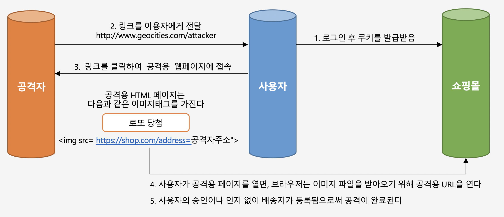

# CSRF 필터

## CSRF란?



CSRF는 쿠키, 세션의 취약점을 이용한 서버에 직접적인 타격을 입히지 않는 공격 행위를 말한다. 

우선 위의 그림에 따른 CSRF 공격의 동작 과정을 보자.

1. CSRF공격은 우선적으로 사용자가 어떠한 웹 사이트에 로그인을 한 상태여야 한다. 따라서 사용자는 로그인을 한 후 세션 쿠키를 발급받는다.
2. 사용자는 로그인한 상태에서 공격자가 임의로 만든 링크가 들어있는 메일이나, 광고 등을 클릭하게 된다. (이 때, 그 링크는 form 태그로 로그인한 사용자의 개인정보를 post로 전송하는 태그일 수도 있고, 사용자의 주소를 공격자에게 전송하는 링크일 수도 있다.)
3. 따라서 사용자는 링크를 클릭하게 되어서 공격자에게 개인정보를 주게 되어 공격이 완료되는 것이다.

## CsrfFilter

- 모든 요청에 대해서 랜덤하게 생성된 토큰을 HTTP 파라미터나 헤더로 요구한다.
	- 즉 스프링 시큐리티가 CSRF 필터를 활성화 해놓으면 로그인한 사용자에게 CSRF 토큰을 발급하게 되어, 다음부터는 사용자는 CSRF 토큰으로 페이지를 요청하게 된다.
- 요청 시 전달되는 토큰 값과 서버에 저장된 실제 값과 비교한 후 만약 일치하지 않으면 요청은 실패한다.

HTML Form 을 사용할 때 위험한 Http Method(PATCH, POST, PUT, DELETE)의 요청이 들어오면 다음과 같이 input 태그같은 곳에다가 CSRF 토큰값을 같이 넣어서 요청해야 한다.

```html
<input type="hidden" name="${_csrf.paramterName}" value="${_csrf.token}"/>
```

CSRF 기본적으로 스프링 시큐리티를 사용하면 별도의 설정없이 기본값으로 적용이 되는데, 다음과 같이 시큐리티 설정정보 파일에 CSRF Filter를 비활성화 시킬 수 있다.

```java
http.csrf().disable();
```

사용자 인증을 할 떄, 쿠키와 세션을 사용하는 애플리케이션의 경우에는 CSRF Filter가 필수적으로 필요하지만, JWT Token을 사용한 인증방식은 세션/쿠키를 이용하지 않기 때문에 비활성화 해야한다.

**CsrfFilter.class**

```java
protected void doFilterInternal(HttpServletRequest request, HttpServletResponse response, FilterChain filterChain)
			throws ServletException, IOException {
	request.setAttribute(HttpServletResponse.class.getName(), response);
	CsrfToken csrfToken = this.tokenRepository.loadToken(request);
	boolean missingToken = (csrfToken == null);
	if (missingToken) {
		csrfToken = this.tokenRepository.generateToken(request);
		this.tokenRepository.saveToken(csrfToken, request, response);
	}
	request.setAttribute(CsrfToken.class.getName(), csrfToken);
	request.setAttribute(csrfToken.getParameterName(), csrfToken);
	if (!this.requireCsrfProtectionMatcher.matches(request)) {
		if (this.logger.isTraceEnabled()) {
			this.logger.trace("Did not protect against CSRF since request did not match "
					+ this.requireCsrfProtectionMatcher);
		}
		filterChain.doFilter(request, response);
		return;
	}
	// 요청 헤더나 파라미터에서 CSRF 토큰이 있는지 확인하고 가져온다.
	String actualToken = request.getHeader(csrfToken.getHeaderName());
	if (actualToken == null) {
		actualToken = request.getParameter(csrfToken.getParameterName());
	}
	// 서버에 저장된 CSRF토큰과 사용자의 CSRF 토큰값을 비교한다.
	if (!equalsConstantTime(csrfToken.getToken(), actualToken)) {
		this.logger.debug(
				LogMessage.of(() -> "Invalid CSRF token found for " + UrlUtils.buildFullRequestUrl(request)));
		AccessDeniedException exception = (!missingToken) ? new InvalidCsrfTokenException(csrfToken, actualToken)
				: new MissingCsrfTokenException(actualToken);
		this.accessDeniedHandler.handle(request, response, exception);
		return;
	}
	filterChain.doFilter(request, response);
}
```