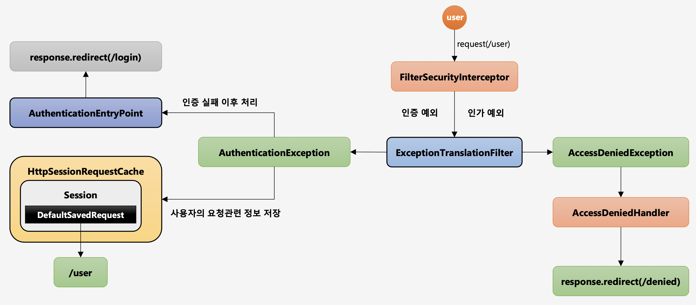

# 인증 / 인가 API - ExceptionTranslationFilter

### AuthenticationException

인증 예외처리를 위한 클래스이다.

1. AuthenticationEntryPoint를 호출
	- 인증받지 않은 사용자는 로그인 페이지로 이동, 401 오류코드 전달 등을 한다.
2. 인증 예외가 발생하기 전의 요청정보를 저장한다.
	- 사용자가 가고자했던 곳(ex: /index)을 저장
	- RequestCache: 사용자의 이전 요청 정보를 세션에 저장하고 이를 꺼내오는 캐시 메커니즘이다.
		- SavedRequest: 사용자가 요청했던 request 파라미터 값들, 그 당시의 헤더값들이 저장된다.

### AccessDeniedException

인가 예외처리를 위한 클래스이다.

1. AccessDeniedHandler 에서 예외를 처리하도록 제공한다.

## ExceptionTranslationFilter



### **예시 1 - 사용자가 인증을 받지않고 /user 자원에 접근**

인증을 받지않고 /user 자원에 접근하게 되면 FilterSecurityInterceptor가 받아서 ExceptionTranslationFilter로 예외를 위임한다.

그런다음 ExceptionTranslationFilter는 인증예외인지 인가예외인지 판단하여 각 특성에 맞는 예외를 던지게 된다.(단, 익명사용자나 RememberMe 사용자는 인가예외로 갔다가 다시 인증예외로 가게된다.)

**ExceptionTranslationFilter.class**

```java
private void handleSpringSecurityException(HttpServletRequest request, HttpServletResponse response,
			FilterChain chain, RuntimeException exception) throws IOException, ServletException {
	// 인증관련 예외라면
	if (exception instanceof AuthenticationException) {
		handleAuthenticationException(request, response, chain, (AuthenticationException) exception);
	}
	// 인가관련 예외라면
	else if (exception instanceof AccessDeniedException) {
		handleAccessDeniedException(request, response, chain, (AccessDeniedException) exception);
	}
}
```

현재 예시에서는 인증 관련 예외가 터졌으니 인증관련 예외가 터지면 ExceptionTranslationFIlter는 AuthenticationException 예외를 터뜨리면서 인증 실패 이후 처리를 하고, 사용자의 요청관련 정보를 저장하게 된다.

**ExceptionTranslationFilter.class**

```java
protected void sendStartAuthentication(HttpServletRequest request, HttpServletResponse response, FilterChain chain,
			AuthenticationException reason) throws ServletException, IOException {
	// SEC-112: Clear the SecurityContextHolder's Authentication, as the
	// existing Authentication is no longer considered valid
	SecurityContext context = SecurityContextHolder.createEmptyContext();
	SecurityContextHolder.setContext(context);
	//사용자의 요청관련 정보를 캐시에 저장하고
	this.requestCache.saveRequest(request, response);
	// 오류코드 및 로그인 페이지 이동 등 예외가 터진 뒤 처리를 해준다.
	this.authenticationEntryPoint.commence(request, response, reason);
}
```

 로그인 페이지 이동을 처리하는 메서드
 
**LoginUrlAuthenticationEntryPoint.class**
 
 ```java
 public void commence(HttpServletRequest request, HttpServletResponse response,
			AuthenticationException authException) throws IOException, ServletException {
	if (!this.useForward) {
		// redirect to login page. Use https if forceHttps true
		String redirectUrl = buildRedirectUrlToLoginPage(request, response, authException);
		this.redirectStrategy.sendRedirect(request, response, redirectUrl);
		return;
	}
	String redirectUrl = null;
	if (this.forceHttps && "http".equals(request.getScheme())) {
		// First redirect the current request to HTTPS. When that request is received,
		// the forward to the login page will be used.
		redirectUrl = buildHttpsRedirectUrlForRequest(request);
	}
	if (redirectUrl != null) {
		this.redirectStrategy.sendRedirect(request, response, redirectUrl);
		return;
	}
	String loginForm = determineUrlToUseForThisRequest(request, response, authException);
	logger.debug(LogMessage.format("Server side forward to: %s", loginForm));
	RequestDispatcher dispatcher = request.getRequestDispatcher(loginForm);
	dispatcher.forward(request, response);
	return;
}
 ```
 
### **예시 2 - 인가받지 않은 사용자가 /admin 자원에 접근**

인가받지 않은 사용자는 /admin 자원에 접근하면 ExceptionTranslationFilter는 AccessDeniedException이 터지게 된다.

**ExceptionTranslationFilter**

```java
private void handleSpringSecurityException(HttpServletRequest request, HttpServletResponse response,
			FilterChain chain, RuntimeException exception) throws IOException, ServletException {
	// 인증관련 예외라면
	if (exception instanceof AuthenticationException) {
		handleAuthenticationException(request, response, chain, (AuthenticationException) exception);
	}
	// 인가관련 예외라면
	else if (exception instanceof AccessDeniedException) {
		handleAccessDeniedException(request, response, chain, (AccessDeniedException) exception);
	}
}
```

이 떄, 아까도 말했듯이 익명 사용자와 RememberMe 사용자도 여기도 이동하기 때문에 이런 사용자와 인가받지 않은 사용자를 구분하게 된다.

**ExceptionTranslationFilter**

```
private void handleAccessDeniedException(HttpServletRequest request, HttpServletResponse response,
			FilterChain chain, AccessDeniedException exception) throws ServletException, IOException {
	Authentication authentication = SecurityContextHolder.getContext().getAuthentication();
	boolean isAnonymous = this.authenticationTrustResolver.isAnonymous(authentication);
	// 익명 사용자 또는 RememberMe 사용자라면 인증 예외 처리를 하게된다.
	if (isAnonymous || this.authenticationTrustResolver.isRememberMe(authentication)) {
		if (logger.isTraceEnabled()) {
			logger.trace(LogMessage.format("Sending %s to authentication entry point since access is denied",
					authentication), exception);
		}
		sendStartAuthentication(request, response, chain,
				new InsufficientAuthenticationException(
						this.messages.getMessage("ExceptionTranslationFilter.insufficientAuthentication",
								"Full authentication is required to access this resource")));
	}
	//아니라면 인가 예외를 처리할 수 있는 AccessDeniedHandler에 의해서 처리하게 된다.
	else {
		if (logger.isTraceEnabled()) {
			logger.trace(
					LogMessage.format("Sending %s to access denied handler since access is denied", authentication),
					exception);
		}
		this.accessDeniedHandler.handle(request, response, exception);
	}
}
```

**AccessDeniedHandlerImpl**

```
public void handle(HttpServletRequest request, HttpServletResponse response,
			AccessDeniedException accessDeniedException) throws IOException, ServletException {
	if (response.isCommitted()) {
		logger.trace("Did not write to response since already committed");
		return;
	}
	if (this.errorPage == null) {
		logger.debug("Responding with 403 status code");
		response.sendError(HttpStatus.FORBIDDEN.value(), HttpStatus.FORBIDDEN.getReasonPhrase());
		return;
	}
	// Put exception into request scope (perhaps of use to a view)
	request.setAttribute(WebAttributes.ACCESS_DENIED_403, accessDeniedException);
	// Set the 403 status code.
	response.setStatus(HttpStatus.FORBIDDEN.value());
	// forward to error page.
	if (logger.isDebugEnabled()) {
		logger.debug(LogMessage.format("Forwarding to %s with status code 403", this.errorPage));
	}
	request.getRequestDispatcher(this.errorPage).forward(request, response);
}
```