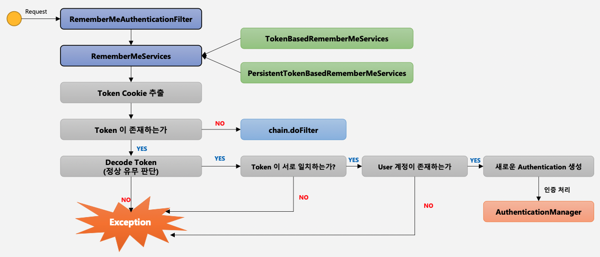

# 인증 API - Remember Me 인증

## Remember Me 란?

세션이 만료되고 웹 브라우저가 종료된 이후에도 어플리케이션이 사용자를 기억하는 기능이다.

Remember-Me 쿠키에 대한 HTTP 요청을 확인한 후, 토큰 기반 인증을 통해서 유효성을 검사하고, 토큰이 검증되면 사용자는 로그인된다.

사용자 라이플 사이클은 다음과 같다.

- 인증 성공(Remember-Me 쿠키 설정)
- 인증 실패(쿠키가 존재하면 쿠키를 무효화)
- 로그아웃(쿠키가 존재하면 쿠키 무효화)

```java
http.rememberMe()						//리멤버 미 기능 활성화
	.rememberMeParameter("remember")		//리멤버 미 파라미터명, 디폴트 값은 remember-me
	.tokenValiditySeconds(3600)			//리멤버 미 토큰 만료시간, 디폴트 값은 14일
	.alwaysRemember(true)					//리멤버 미 기능이 활성화되지 않아도 항상 실행(true)
	.userDetailsService(userDetailsService);	//리멤버 미 기능을 위해서 사용자 정보 조회 때문에 필요
```

## RememberMeAuthenticationFilter

리멤버 미 기능을 사용하면 기본적으로 RememberMeAuthenticationFilter에 의해서 인증이 된다. 단, 이 필터가 동작하기 위해서는 두 가지 조건중에 **하나의 조건**이 만족되어야 한다.

1. SecurityContext에 담겨있는 **인증 객체(Authentication)가 null 이어야 한다**
	- 세션이 **만료**되었거나, **브라우저를 종료해서 세션이 없을 경우** 인증 객체를 SecurityContext에서 찾지 못하기 때문이다.
2. **이전 로그인 시 remember-me 기능을 활성화**해서 사용자가 remember-me 쿠키를 가지고 있는 경우
	- 세션이 만료되거나 세션이 없어도, 사용자는 이전에 서버로부터 발급받은 remember-me 쿠키를 Request Header에 넣어서 요청한다.

이 두가지 조건중에 하나만 만족해도 해당 필터가 동작해서 인증 처리를 진행하게된다.



세부적인 동작 과정을 설명하면 다음과 같다.

우선적으로 위의 두 개의 조건중에 하나가 만족하면 실질적으로 리멤버 미 인증을 처리해주는 RememberMeServices 가 호출된다. 

RememberMeServices를 구현한 클래스는 두 가지가 있다.

- TokenBasedRememberMeServices
	- **메모리** 상에 저장된 토큰과 사용자의 토큰 값을 비교한다.
- PersistentTokenBasedRememberMeServices
	- **DB**에 저장된 토큰과 사용자의 토큰 값을 비교한다.

RememberMeServices 는 우선적으로 토큰이 들어있는 쿠키를 추출하고, 그 쿠키 안에 remember-me 토큰이 존재하는지 확인한다.

```java
String rememberMeCookie = extractRememberMeCookie(request);
```

토큰이 존재하지 않으면 다음 필터를 호출하고, 그렇지 않다면(토큰이 존재한다면) 토큰의 규칙을 판단하여 정상인 remember-me 토큰인지 판단한다.

```java
String[] cookieTokens = decodeCookie(rememberMeCookie);
```

이 과정이 정상적으로 끝나면 메모리나 DB에 저장된 토큰과 사용자가 들고온 토큰이 서로 일치하는지 확인한다. 

```java
String expectedTokenSignature = makeTokenSignature(tokenExpiryTime, userDetails.getUsername(),
				userDetails.getPassword());
if (!equals(expectedTokenSignature, cookieTokens[2])) {
			throw new InvalidCookieException("Cookie token[2] contained signature '" + cookieTokens[2] + "' but expected '" + expectedTokenSignature + "'");
}
```

그러고 나서 User 계정이 존재하는지 확인하고 새로운 Authentication 객체를 생성하고 인증처리를 한다.

```java
this.userDetailsChecker.check(user);
this.logger.debug("Remember-me cookie accepted");
return createSuccessfulAuthentication(request, user);
```