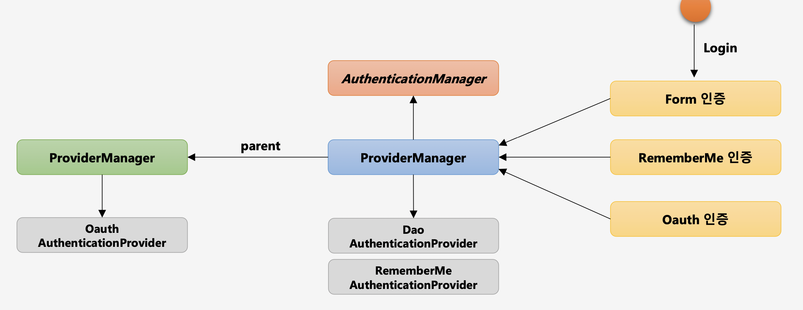

# AuthenticationManager

- **인증 처리를 관리**하는 역할을 한다.
- **실제 인증 처리를 AuthenticationProvider에게 위임**한다.
- 즉, AuthenticationProvider 목록 중에서 가장 적합한 AuthenticationProvider를 찾아서 인증 처리를 위임한다.
- 마땅히 인증처리할 AuthenticationProvider가 없다면 부모 AuthenticationManager 객체에서 적합한 AuthenticationProvider를 찾아서 위임하게 된다.



#### 인증 처리를 할 수 있는 AuthenticationProvider 탐색

**ProviderManager(AuthenticationManager의 구현체)**

```java
for (AuthenticationProvider provider : getProviders()) {
	// 적합하지 않다면 다음 provider를 탐색
	if (!provider.supports(toTest)) {
		continue;
	}
	if (logger.isTraceEnabled()) {
		logger.trace(LogMessage.format("Authenticating request with %s (%d/%d)",
				provider.getClass().getSimpleName(), ++currentPosition, size));
	}
	// 실제 인증처리
	try {
		result = provider.authenticate(authentication);
		if (result != null) {
			copyDetails(authentication, result);
			break;
		}
	}
	catch (AccountStatusException | InternalAuthenticationServiceException ex) {
		prepareException(ex, authentication);
		// SEC-546: Avoid polling additional providers if auth failure is due to
		// invalid account status
		throw ex;
	}
	catch (AuthenticationException ex) {
		lastException = ex;
	}
}
```

#### 마땅히 인증처리할 AuthenticationProvider를 못찾는다면 부모 AuthenticationManager에서 Provider 탐색

**ProviderManager(AuthenticationManager의 구현체)**

```java
if (result == null && this.parent != null) {
	// Allow the parent to try.
	try {
		parentResult = this.parent.authenticate(authentication);
		result = parentResult;
	}
	catch (ProviderNotFoundException ex) {
		// ignore as we will throw below if no other exception occurred prior to
		// calling parent and the parent
		// may throw ProviderNotFound even though a provider in the child already
		// handled the request
	}
	catch (AuthenticationException ex) {
		parentException = ex;
		lastException = ex;
	}
}
```