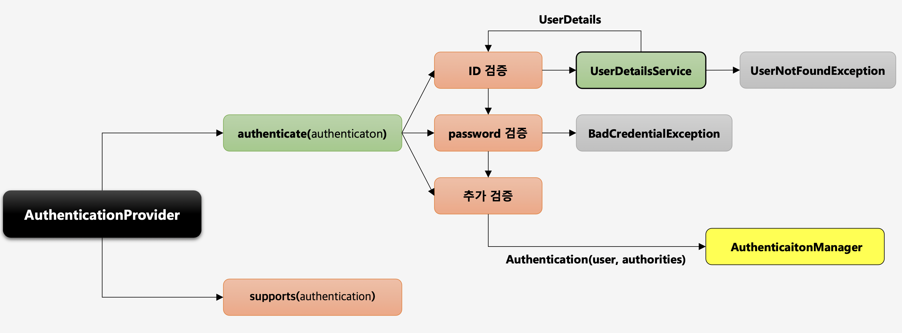

# AuthenticationProvider

- 실제 인증을 처리하는 클래스이다.
- 실제로 여러가지 검증을 수행하는 클래스이다.

### 동작 흐름

1. 이 provider 가 받은 인증(Authentication) 객체를 처리할 수 있는지 판단한다.
2. 처리할 수 있는 provider라면 인증을 수행한다.
3. 유저 이름에 해당하는 유저가 있다면 다음 단계로 넘어가고, 없다면 UsernameNotFound 예외를 발생시킨다.
4. 해당 유저 이름에 대한 비밀번호가 일치하면 다음 단계로 넘어가고, 없다면 BadCredential 예외를 발생시킨다.
5. 추가적으로 권한에 대한 정보 등 검증할 것이 있다면 검증하고 성공하면 다음 단계로 넘어가고, 없다면 예외를 발생시킨다.
6. 검증이 성공적으로 완료되면 AuthenticationManager에게 실제 인증객체를 만들어서 넘겨준다.