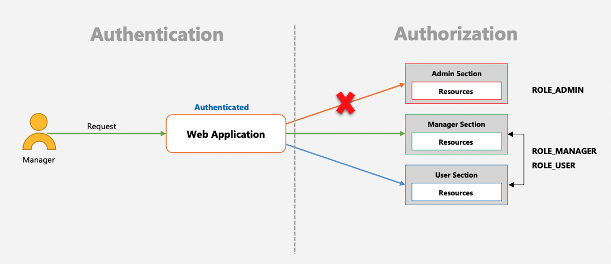
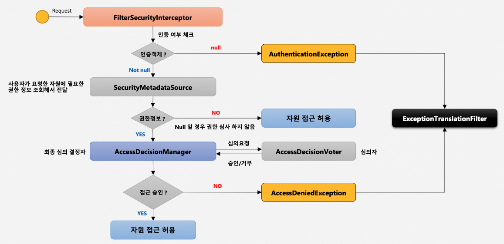

# Authorization

- 인가에 관한 것이다.
- 즉, 사용자가 어떤 자원에 접근할 수 있는 권한이 있는지 증명하는 것이다.
- 예를들어 MANAGER 권한이 있는 사용자가 admin 자원에 접근했을 때 다음과 같은 상황이 발생한다.



### 여러가지 권한 계층

- 웹 계층: URL 요청에 따른 메뉴 혹은 화면단위의 레벨 보안
- 서비스 계층: 화면 단위가 아닌 메소드 같은 기능 단위의 레벨 보안
	- ex) 메서드 레벨에 @Secured 애노테이션 등을 달아서 권한을 검증한다.
- 도메인 계층: 객체 단위의 레벨 보안

# FilterSecurityInterceptor

- 마지막의 위치한 필터로써 인증된 사용자에 대하여 특정 요청의 승인/거부 여부를 최종적으로 결정
- 인증객체 없이 보호자원에 접근을 시도할 경우 AuthenticationException을 발생한다.
- 인증 후 자원에 접근 가능한 권한이 존재하지 않을 경우 AccessDeniedException을 발생시킨다.
- 권한 제어 방식 중 HTTP 자원의 보안을 처리하는 필터이다.
- 권한 처리를 AccessDecisionManager에게 맡긴다.

### 흐름



- 사용자의 요청이 들어오면 인증이 된 사용자인지 인증 여부를 체크한다. 인증객체가 없다면 인증 예외를 발생시킨다.

**FilterSecurityInterceptor의 구현체**

```java
if (SecurityContextHolder.getContext().getAuthentication() == null) {
	credentialsNotFound(this.messages.getMessage("AbstractSecurityInterceptor.authenticationNotFound",
			"An Authentication object was not found in the SecurityContext"), object, attributes);
}
```
-  인증이 완료된 객체라는 것이 검증이 되었다면, 요청한 자원에 필요한 권한 정보를 조회해서 전달한다. 이 때, 권한이 필요하지 않은 자원이라면 접근을 허용하고, 아니라면 최종 심의 결정자(AccessDeniedManager)에 의해서 심의 과정을 거친다. 최종 심의 결정자는 심의자에게 심의 요청을 하고, 승인이나 거부 여부를 받는다.

**AccessDeniedManager의 구현체**

```java
for (AccessDecisionVoter voter : getDecisionVoters()) {
	...
}
```

- 심의자에 의해서 승인이 거부되면 AccessDeniedException 예외를 발생시키고, 아니면 자원에 대해 접근을 허용한다.