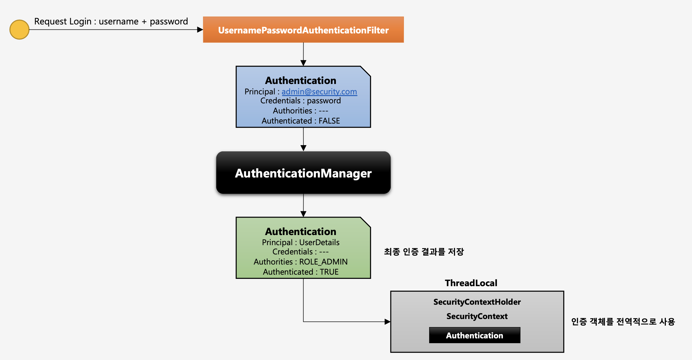

# Authentication

- **인증 객체**
- 당신이 누구인지 증명하는 것
- 사용자의 인증 정보를 저장하는 토큰의 개념이라고 할 수 있다.
- 인증 시 id와 password를 담고 인증 검증을 위해 전달되어 사용된다.
- 인증 후 **최종 인증결과(User 객체, 권한 정보)**를 담고 `SecurityContext`에 저장되어 **전역적으로 참조가 가능**하다.
- 구조
	- principal: 사용자 아이디 혹은 User 객체를 저장
	- credentials: 사용자 비밀번호
	- authorities: 인증된 사용자의 권한 목록
	- details: 인증 부가정보
	- Authenticated: 인증 여부

### 사용자 인증 흐름

1. 사용자가 로그인 요청을 하면 인증 필터를 통해서 인증 검증을 받는다.
2. 인증 필터는 가짜 인증 객체를 만들어서 AuthenticationManager에게 실제 인증을 위임한다.
3. 인증이 성공적으로 완료되면 실제 인증 객체를 생성해서 SecurityContext에 저장하여 인증 객체를 전역적으로 사용할 수 있도록 한다.

