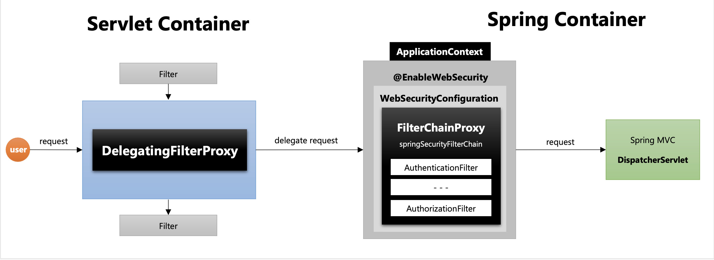

# DelegatingFilterProxy

스프링 시큐리티는 일반적으로 **서블릿 필터 기반으로 동작**한다.

하지만 서블릿 필터는 **서블릿 컨테이너에 정의된 자원**이기 때문에 **스프링 빈을 주입받아서 사용할 수 없다.**

근데, 스프링을 사용하는데 스프링 기술들을 사용할 수 없는게 말이 안되고, 시큐리티 개발자들은 필터에서도 스프링 빈을 주입받아서 쓰고자 했다.. 이래서 등장한 개념이 `DelegatingFilterProxy` 이다.

이 DelegatingFilterProxy가 하는 역할은 간단히 말해서 다음과 같다.

- 특정한 이름을 가진 스프링 빈을 찾아서 그 빈에게 요청을 위임한다.
- 즉, `springSecurityFilterChain` 이름으로 생성된 빈을 ApplicationContext에서 찾아서 그 빈(FilterChainProxy)에게 요청을 위임한다.
- 따라서, `DelegatingFilterProxy`는 실제 보안처리를 하진 않고 위임하는 역할만 수행한다.

# FilterChainProxy

- `SpringSecurityFilterChain`의 이름으로 생성되는 **필터 빈**이다.
- `DelegatingFilterProxy` 으로 부터 **요청을 위임받고 실제 보안처리**를 한다.
- 스프링 시큐리티 **초기화 시 생성되는 필터들을 관리하고 제어**한다.
	- 스프링 시큐리티가 기본적으로 생성하는 필터
	- 설정 클래스에서 API 추가 시 생성되는 필터
- 사용자의 요청을 **필터 순서대로 호출하여 전달**
- 사용자 정의 필터를 생성해서 기존의 필터 **전, 후로 추가가 가능**하다.
	- 필터의 순서를 잘 정의해야 한다.
- **마지막 필터까지 인증 및 인가 예외가 발생하지 않으면 보안이 통과**된다.

# 동작원리

1. 사용자의 요청이 들어오면 서블릿 필터를 먼저 거쳐서 각각의 필터들이 우선적으로 필터링을 하게 된다. 하지만 스프링 시큐리티를 사용하면 서블릿 컨테이너에 등록되어있는 필터인 DelegatingFilterProxy로 먼저 들어간다.
2. DelegatingFilterProxy 필터에게 사용자 요청이 들어오면 springSecurityFilterChain으로 등록된 빈(FilterChainProxy)을 스프링 컨테이너에서 찾아서 실제 보안 처리를 위임하게 된다.
3. FilterChainProxy은 등록되어있는 보안 관련된 필터들을 순서대로 돌면서 필터링 한다.
4. 보안 관련 필터링이 끝나면 WAS에 등록된 필터(일반 서블릿 필터)가 이제서야 필터링을 하게된다.
5. 모든 필터를 성공적으로 통과하면 디스패처 서블릿으로 요청이 수행된다.