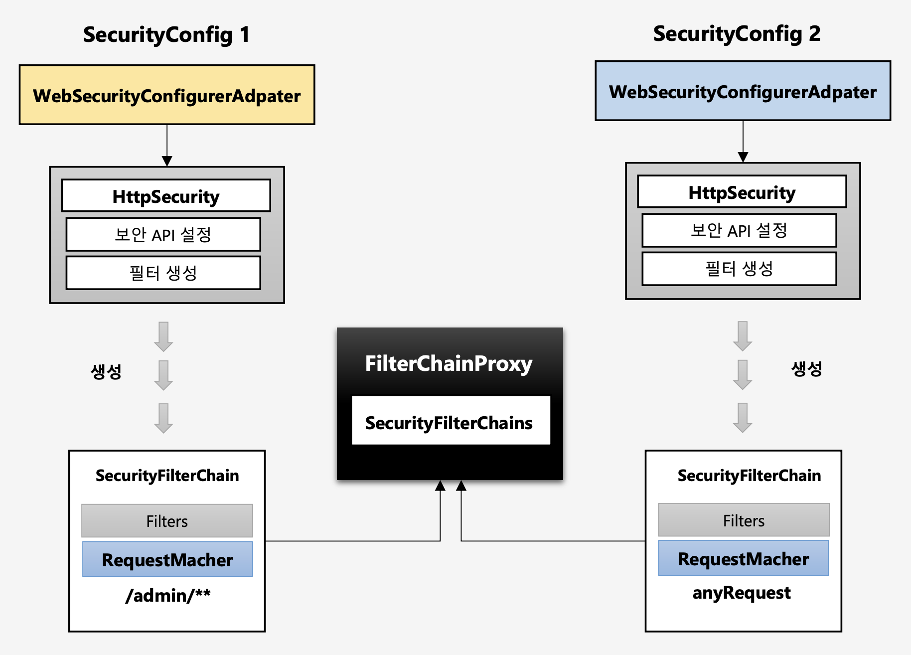
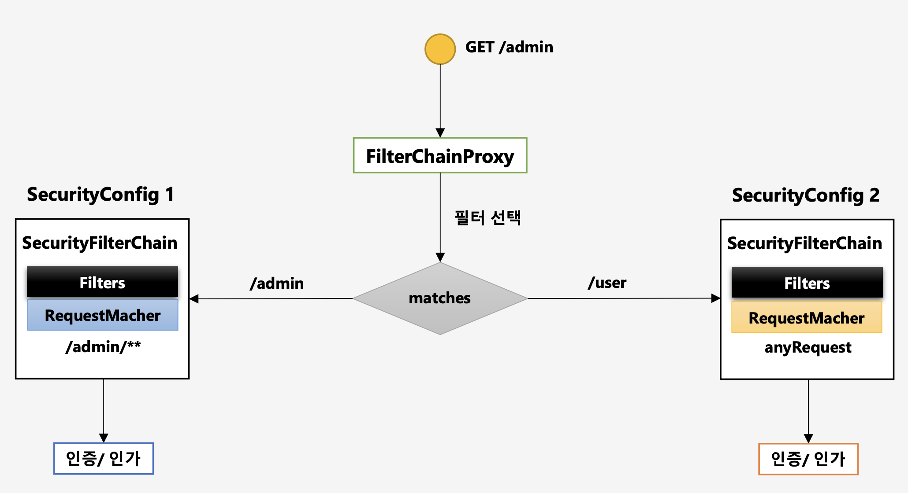

# 필터 초기화와 다중 설정 클래스

스프링 시큐리티를 사용하여 API에 따른 인증, 인가 처리를 진행하면서, 서로 다른 자원에 따라서 인증, 인가 설정을 다르게 해야할 때가 있다.

이 때, 스프링 시큐리티는 특정 자원에 접근하는 API에 따라서 인증, 인가 처리 필터를 다르게 적용하는 방법을 명시해두었는데, 바로 설정 클래스를 여러개 두는 것이다.

위 그림처럼 두개의 설정 클래스를 등록할 수 있다.

하나는 admin 역할에 대한 인증, 인가 처리를 위한 클래스로 등록하고, 다른 하나는 모든 요청에 대해서 공통 처리를 하도록 할 수 있는 것이다.

단, 이렇게 다중 설정 클래스를 시큐리티에 등록할 때, 누가 먼저 작동할 것인지 순서를 지정해주어야 한다. 순서 지정은 설정 클래스 레벨에 @Order 애노테이션으로 지정해주면 된다.

정리하면 다음과 같다.

- 설정 클래스별로 보안 기능이 각각 작동한다.
- 설정 클래스별로 RequestMatcher를 설정하여 서로 다른 자원에 접근할 때, 작동하도록 할 수 있다.
- 설정 클래스별로 별도로 필터가 생성된다.
	- 각각 등록한 정보가 다르기 때문에 별도로 생성된다.
- FilterChainProxy 가 각 필터들을 가지고 있다.

또한 다음 그림처럼 관리자와 일반 사용자의 요청에 따라서 다른 설정클래스를 지정할 수도 있다.

