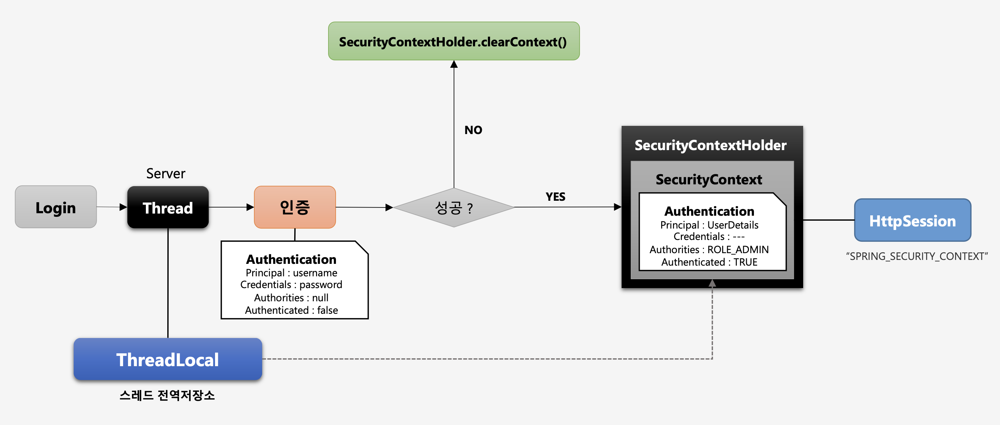

# SecurityContextHolder & SecurityContext

### SecurityContext

- Authentication 객체가 저장되는 보관소로 필요 시 언제든지 Authentication 객체를 꺼내어 쓸 수 있도록 하는 클래스
- ThreadLocal에 저장되어 아무 곳에서나 참조가 가능하도록 설계함
- 인증이 완료되면 HttpSession에 저장되어 어플리케이션 전반에 걸쳐 전역적인 참조가 가능하다.

> ThreadLocal: 오직 한 쓰레드에 의해서 읽고 쓰여질 수 있는 변수라고 생각하면 쉽다. 즉, 두 쓰레드가 같은 코드를 실행하고 이 코드가 하나의 ThreadLocal 변수를 참조하더라도 서로의 ThreadLocal 변수를 볼 수 없다.

### SecurityContextHolder

- SecurityContext 객체 저장 방식
	- MODE_THREADLOCAL: 스레드당 SecurityContext 객체를 할당(기본값)
	- MODE_INHERITABLETHREADLOCAL: 메인 스레드와 자식 스레드에 관하여 동일한 SecurityContext 를 유지
	- MODE_GLOBAL: 응용 프로그램에서 단 하나의 SecurityContext를 저장한다.
- SecurityContextHolder.clearContext(): SecurityContext 기존 정보 초기화

### 동작 흐름

1. 사용자가 로그인을 시도하면 서버가 내부적으로 스레드를 생성하고 인증을 시작한다.
2. 인증이 실패하면 SecurityContextHolder(=ThreadLocal)에 들어있는 SecurityContext를 초기화하고, 인증이 성공하면 SecurityContextHolder에 인증객체가 들어있는 SecurityContext를 저장한다. 이에 또한 스레드 로컬은 SecurityContext를 담고 있게된다.
3. 또한, 세션을 사용하는 경우 인증 객체를 HttpSession에 저장한다.